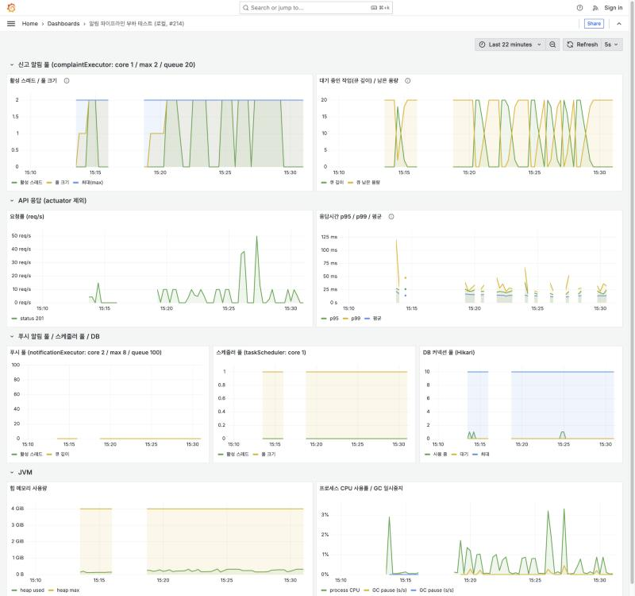
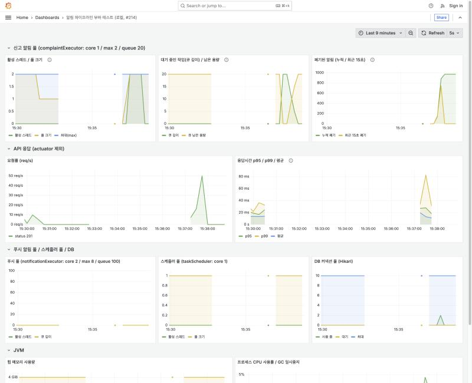

# 신고 알림 파이프라인 로컬 부하 테스트 리포트

- 이슈: #214
- 대상: `POST /complaints` 와 그 뒤의 비동기 알림 (`ComplaintEventListener` → `ComplaintSlackSender` → 웹훅)
- 측정일: 2026-10-08
- 성격: **노트북 로컬 측정이다. 운영 성능이 아니다.** 외부 서비스(n8n, Slack, FCM)는 호출하지 않고 가짜 웹훅 서버로 대체했다.

이 문서는 "웹훅이 느리거나 실패하거나 폭주해도 신고 API는 영향을 받지 않는가?"를 숫자로 확인한 기록이다.

---

## 1. 결론 요약

| 질문 | 판정 | 핵심 수치 |
|---|---|---|
| Q1. 웹훅이 느려도(4초) 신고 API 응답이 영향을 받나? | **영향 없음 (합격)** | S1 평균 p95 19.97ms vs S0 21.42ms (−1.45ms, −6.8%). S1 범위(18.1~21.1)가 S0 범위(18.9~25.6) 안에 들어감 |
| Q2. 폭주 시 신고 API는 어떻게 되나? | **합격** | 초당 50건 × 20초(신고 1,000건/1,001건)에서 **전부 201**, p95 17.0ms / 16.3ms, ERROR 0 |
| Q3. 알림은 정확히 몇 건이 버려지나? | **회계 일치 (합격)** | 11개 실행 모두 `신고 201 = 웹훅 도착 + 폐기`, **설명되지 않는 건수 0** |
| Q4. 웹훅 403/500에서도 안전한가? | **합격** | 500 ×201건, 403 ×200건 전부 `HTTP 코드`만 로그에 남음. 로그의 URL·시크릿 노출 **0건**, 신고 API 영향 없음 |
| Q5. 시크릿 헤더가 실제로 전송되고, 틀리면 거부되나? | **합격** | 정상 시크릿 전 건 통과, 불일치 200건 모두 403 |

**이 측정이 드러낸 설계의 한계 (정직한 발견)**: 신고 알림 풀은 *웹훅이 느리면 매우 적은 양만 소화한다.* 웹훅 응답이 4초일 때 초당 10건(S1, 평범한 부하)에서도 알림의 **약 88%가 폐기**됐고, 초당 50건(S2)에서는 **약 97%** 가 폐기됐다. 신고 API는 영향이 없지만 **알림은 유실된다.** 신고가 드문 이벤트라는 전제에서는 허용 가능한 설계이지만, 규모가 커지면 큐·아웃박스가 필요하다는 근거가 된다. (6장)

---

## 2. 측정 환경

| 항목 | 값 |
|---|---|
| 머신 | Apple M5, 10코어, 메모리 16GB, macOS 26.1 (앱·DB·k6·가짜 서버·Prometheus·Grafana가 **같은 PC**에서 동작) |
| 앱 | Spring Boot 3.5.3, Java 17.0.20.1(Temurin), 기본 JVM 옵션, `./gradlew bootRun` |
| DB / 캐시 | Docker `mysql:8` (실제 버전 **8.4.11**), Docker `redis:7` |
| 부하 도구 | k6 v2.2.0, 실행기 `constant-arrival-rate` (서버 속도와 무관하게 일정한 도착률) |
| 웹훅 | 가짜 서버 `scripts/perf/fake-webhook.py` (지연·응답 코드 제어, 시크릿 검증) |
| 모니터링 | Prometheus v3.0.1(5초 수집), Grafana 11.4.0, Micrometer |
| FCM | 서비스 계정 키 비움(`초기화 스킵`), 테스트 유저에 FCM 토큰 없음 → 푸시 호출 없음 |
| 로그 | 루트 로그 레벨 WARN, Hibernate SQL 출력 off (요청별 로그가 응답시간에 끼어들지 않도록) |
| 알림 풀 | `complaintExecutor` core 1 / max 2 / queue 20 (메트릭으로 확인), 거부 시 경고 1줄 후 폐기 |
| 웹훅 타임아웃 | 5초 (`ComplaintSlackSender`) |
| 인증 | 로컬 서명 JWT를 미리 발급(테스트 유저 200명). 운영 코드 변경 없음 |

---

## 3. 방법

- **시나리오 한 번의 흐름** (`scripts/perf/run-scenario.py`): 가짜 웹훅 설정 → 신고 데이터 삭제 → k6 실행 → 알림이 모두 처리될 때까지 대기(8초간 새 도착이 없을 때까지) → 결과 대조.
- **신고 조합**: (신고자, 대상, 사유)가 UNIQUE라서, 유저 200명 × 대상 199명 × 사유 4개(OTHER 제외) = 159,200개 조합을 번호로 계산해 중복(409) 없이 소진했다.
- **노이즈 대응**: 워밍업 1회는 결과에서 제외(JIT·커넥션 풀). 비교가 핵심인 S0와 S1은 **교차해서 3회씩** 실행(시간에 따른 드리프트 상쇄).
- **회계 대조**: `신고 201 건수 = 가짜 서버 도착 건수 + 앱이 폐기한 건수(경고 로그)`. 어긋나면 알림이 설명 없이 사라진 것이다.

| 시나리오 | 가짜 웹훅 | 부하 |
|---|---|---|
| S0 기준선 | 즉시 200 | 초당 10건 × 30초 (3회) |
| S1 느린 웹훅 | **4초 지연**, 200 | 초당 10건 × 30초 (3회) |
| S2 폭주 | 4초 지연, 200 | **초당 50건 × 20초** (2회) |
| S1t 타임아웃 | **8초 지연**(앱 타임아웃 5초 초과) | 초당 10건 × 20초 |
| S3 웹훅 오류 | 즉시 **500** | 초당 10건 × 20초 |
| S4 시크릿 불일치 | 앱이 보낸 시크릿과 다른 값을 기대 → **403** | 초당 10건 × 20초 |

> 느린 응답을 5초가 아닌 4초로 둔 이유: 앱의 웹훅 타임아웃이 5초라 5초 지연은 타임아웃과 겹쳐 결과가 모호해진다. 타임아웃 초과는 S1t(8초)로 따로 본다.

---

## 4. 결과

(`python3 scripts/perf/summarize-results.py`의 출력. 시간 단위는 ms)

| 시나리오 | 요청 | 201 | p50 | p95 | p99 | max | 웹훅 도착 | 폐기 | 전송실패 경고 | 피크 스레드/큐 | ERROR | URL·시크릿 노출 | 설명 안 되는 건 |
|---|---|---|---|---|---|---|---|---|---|---|---|---|---|
| s0-r1 | 300 | 300 | 15.8 | 25.64 | 34.32 | 97.46 | 300 | 0 | 0 | 0 / 0 | 0 | 0 | 0 |
| s0-r2 | 300 | 300 | 14.42 | 19.69 | 34.74 | 53.96 | 300 | 0 | 0 | 0 / 0 | 0 | 0 | 0 |
| s0-r3 | 301 | 301 | 13.38 | 18.93 | 58.91 | 86.87 | 301 | 0 | 0 | 0 / 0 | 0 | 0 | 0 |
| s1-r1 | 301 | 301 | 15.58 | 20.78 | 28.7 | 38.94 | 35 | 266 | 0 | 2 / 20 | 0 | 0 | 0 |
| s1-r2 | 301 | 301 | 13.61 | 21.05 | 28.68 | 91.1 | 36 | 265 | 0 | 2 / 20 | 0 | 0 | 0 |
| s1-r3 | 300 | 300 | 13.86 | 18.08 | 28.6 | 45.59 | 36 | 264 | 0 | 2 / 20 | 0 | 0 | 0 |
| s2-r1 | 1000 | 1000 | 11.97 | 17.02 | 27.61 | 61.58 | 30 | 970 | 0 | 2 / 20 | 0 | 0 | 0 |
| s2-r2 | 1001 | 1001 | 11.31 | 16.3 | 27.78 | 56.3 | 30 | 971 | 0 | 2 / 20 | 0 | 0 | 0 |
| s1t | 200 | 200 | 13.6 | 19.95 | 26.02 | 35.3 | 28 | 172 | 28 | 2 / 20 | 0 | 0 | 0 |
| s3 | 201 | 201 | 13.66 | 20.99 | 31.13 | 67.52 | 201 | 0 | 201 | 0 / 0 | 0 | 0 | 0 |
| s4 | 200 | 200 | 13.78 | 19.82 | 35.08 | 37.79 | 200 | 0 | 200 | 0 / 0 | 0 | 0 | 0 |

- 모든 실행에서 신고 API는 **요청 수 전부 201**(409, 401, 기타 0), k6가 도착률을 못 맞춰 버린 요청(dropped)도 0이었다.
- S0 p95 3회: 25.64 / 19.69 / 18.93 (평균 21.42, 범위 18.93~25.64), S1 p95 3회: 20.78 / 21.05 / 18.08 (평균 19.97, 범위 18.08~21.05).
- S3(500)·S4(403)에서 웹훅 서버가 돌려준 코드와 앱 로그의 `HTTP` 코드가 건수까지 일치했다 (500 ×201, 403 ×200).
- S1t: 5초 타임아웃으로 `전송 실패: IllegalStateException`(예외 종류만) 28건. URL·시크릿·예외 메시지는 로그에 없다.
- 시스템 대시보드: [images/dashboard-full-run.jpg](images/dashboard-full-run.jpg) — 폭주 구간의 큐 깊이 20 포화와 평탄한 p95가 찍혀 있다.



---

## 5. 해석

### 5.1 신고 API가 알림과 분리돼 있다 (Q1, Q2)
- S0(웹훅 즉시)와 S1(웹훅 4초)의 p95 차이는 −1.45ms로, **회차 간 변동(S0 안에서만 6.7ms)보다 작다.** 즉 "차이가 없다"고 말할 수 있고, "S1이 더 빠르다"고 말할 수는 없다. 합격 기준(+10% 이내)은 충족한다.
- 알림 폐기가 970건 일어나는 동안에도 신고 1,000건이 모두 201이었다. 폐기는 경고 로그 1줄이고 ERROR 스택트레이스는 없었다. (앱 로그의 ERROR 1줄은 기동 시점 macOS Netty DNS 라이브러리 메시지이며 시나리오와 무관하다.)

### 5.2 알림 풀의 처리 용량은 산식으로 예측된다 (Q3)
스레드풀은 core 1 → 큐 20 → 추가 스레드(최대 2) → 거부 순서로 동작한다. 처음 받아 줄 수 있는 양은 22건이고, 이후는 스레드 2개가 웹훅 응답 시간만큼 걸려 처리한다.

`전달 건수 ≈ 22 + (2 ÷ 웹훅 지연[초]) × 지속시간[초]`

| 시나리오 | 산식 예측 | 실측 |
|---|---|---|
| S1 (4초, 30초) | 22 + 0.5×30 = 37 | 35 / 36 / 36 |
| S2 (4초, 20초) | 22 + 0.5×20 = 32 | 30 / 30 |
| S1t (타임아웃 5초 점유, 20초) | 22 + 0.4×20 = 30 | 28 |

실측이 산식보다 1~2건 적다(스레드 기동·종료 시점 차이로 보인다). 사전 가설(초당 50건 × 20초에서 전달 약 30건, 폐기 약 970건)과도 일치한다.

### 5.3 로그가 안전하다 (Q4, Q5)
- 403/500/타임아웃에서 로그에는 `HTTP 코드` 또는 예외 클래스 이름만 남았고, 전체 앱 로그(3,364줄)에서 가짜 웹훅 주소·시크릿 문자열 검색 결과는 0건이다.
- 시크릿이 맞으면 전 건이 통과(`secret_ok`), 틀리면 200건 모두 403이었다. 헤더는 신고 알림 구조화 필드(`occurredAt` 등)와 함께 전송됨을 가짜 서버가 집계로 확인했다.

---

## 6. 한계와 주의

**측정의 한계**
- 로컬 단일 PC(앱·DB·부하 도구·모니터링이 자원 공유), 요청별 로그를 WARN으로 낮춘 상태다. 운영 수치로 읽으면 안 된다.
- S0·S1은 3회씩이라 통계적 유의성 검정은 하지 않았다. 판정은 범위 비교와 합격 기준 충족 여부다.
- **S2의 p95(16~17ms)가 S0(19~25ms)보다 낮은 것은 실행 순서에 따른 JIT 워밍업 효과**로 보인다. 서로 다른 단계의 시나리오끼리는 직접 비교하지 않는다. (S0↔S1은 교차 실행이라 비교 가능)
- 피크 활성 스레드·큐 깊이는 Prometheus 5초 샘플이라, 알림이 즉시 끝나는 S0·S3·S4에서는 0으로 보인다. 지연이 있는 S1·S2·S1t에서만 의미가 있다.
- 가짜 서버의 `client_aborted`(앱 타임아웃으로 연결이 끊긴 건수)는 S1t에서 0으로 나왔는데, 소켓 버퍼 때문에 서버가 끊김을 못 알아챈 것으로 **신뢰할 수 없는 지표**다. 타임아웃 건수는 앱 로그(`IllegalStateException` 28건)를 기준으로 본다.
- 이 측정은 신고 알림 경로만 다뤘다. 푸시 풀(`notificationExecutor`)과 스케줄러 실패 알림은 범위 밖이다.

**설계의 한계 (측정이 보여준 것)**
- 웹훅이 느리면 알림 풀의 처리량은 `2 ÷ 지연`으로 매우 작다(4초 지연에서 0.5건/초). 초당 10건의 평범한 부하에서도 약 88%가 폐기됐다.
- 폐기된 알림은 **재시도되지 않고 복구할 방법이 없다.** 신고 데이터는 DB에 남으므로 원본은 안전하지만, 운영자가 알림으로 인지하지 못한다.
- 개선 후보: (1) 알림 이벤트를 DB(outbox)에 기록하고 워커가 재시도, (2) 큐를 메시지 브로커로 이동, (3) 웹훅 타임아웃을 줄여 스레드 점유 시간을 낮춤, (4) 폐기 건수를 메트릭 카운터로 노출해 알람. → **(4)는 이 이슈에서 구현했다 (7장).**

---

## 7. 재현 방법

```bash
# 1) 모니터링 스택 (이미지가 로컬에 있으면 내려받기 없음)
python3 scripts/perf/make-prometheus-token.py
docker compose -f scripts/perf/monitoring/docker-compose.yml up -d

# 2) 테스트 유저와 토큰
scripts/perf/loadtest-data.sh setup

# 3) 가짜 웹훅 서버와 앱 (앱은 가짜 웹훅이 떠 있어야 시작된다)
python3 scripts/perf/fake-webhook.py &
scripts/perf/run-app-loadtest.sh start

# 4) 전체 시나리오 (약 15분) 또는 개별 시나리오
scripts/perf/run-all-scenarios.sh
scripts/perf/run-scenario.py --name s2 --rate 50 --duration 20s --delay-ms 4000

# 5) 집계 / 정리
python3 scripts/perf/summarize-results.py
scripts/perf/run-app-loadtest.sh stop
scripts/perf/loadtest-data.sh cleanup
```

Grafana: http://localhost:3000 (익명 Viewer). 결과 파일은 `scripts/perf/out/`(gitignore 대상)에 남는다.

**실행 전 안전 점검**: 실제 n8n 웹훅 주소와 `FIREBASE_CREDENTIALS_BASE64`가 환경에 남아 있지 않은지 확인한다. `run-app-loadtest.sh`는 웹훅 URL을 가짜 서버로, 시크릿을 더미 값으로 고정하고 FCM 키를 비운다. 도구는 활성 DB가 localhost가 아니면 중단한다.

---

## 8. 후속 개선: 폐기 건수 메트릭 (`notification_dropped_total`)

측정 중에는 폐기 건수를 앱 로그의 경고를 세어서만 알 수 있었다. 이를 Micrometer 카운터로 노출했다.

| 항목 | 내용 |
|---|---|
| 지표 | `notification_dropped_total{name="complaintExecutor"}` (counter, "큐가 가득 차 폐기된 알림 수") |
| 위치 | `AsyncConfig`의 신고 알림 풀 `RejectedExecutionHandler`에서 폐기 시 +1 |
| 안전 | 레지스트리를 `ObjectProvider`로 지연 조회하고 예외는 삼킨다. 카운터 때문에 알림 경로가 실패하지 않으며, 레지스트리가 없으면(수동 생성 테스트) 건너뛴다 |
| 초기값 | 풀 생성 시 0으로 미리 등록해, 첫 폐기 전에도 시계열이 있다 (없으면 알람 규칙이 "데이터 없음"이 된다) |
| 대시보드 | "폐기된 알림 (누적 / 최근 15초)" 패널 추가 (14패널) |

**검증 (같은 로컬 환경)**

| 시나리오 | 신고 | 폐기 메트릭 증가분 | 로그 폐기 경고 | 일치 |
|---|---|---|---|---|
| 평소 (웹훅 즉시, 초당 10건 × 10초) | 101건 전부 201 | 0 | 0 | 일치 |
| 폭주 (웹훅 4초 지연, 초당 50건 × 20초) | 1,001건 전부 201 | **971** | **971** | 일치 |

- 단위 테스트(`AsyncConfigTest` 신규 2건): 폐기마다 카운터가 늘고(받아들인 22건은 세지 않음), 첫 폐기 전에도 0으로 등록돼 있으며, 레지스트리가 없어도 폐기 경로가 예외를 던지지 않는다.
- 이제 `scripts/perf/run-scenario.py`가 메트릭 증가분과 로그를 매 실행마다 교차 검증한다.
- 알람 규칙 예(미적용): `increase(notification_dropped_total[5m]) > 0` 이면 알림이 유실되고 있다는 신호.
- 증거 화면: [images/dashboard-dropped-counter.jpg](images/dashboard-dropped-counter.jpg)


